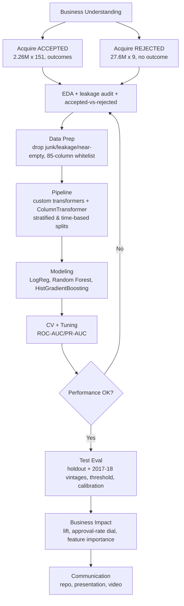

# Predicting Loan Default Across the Credit Funnel
### Reducing Credit Losses on a Consumer-Lending Platform (LendingClub, 2007–2018)

**Author:** Eric Bowers, Data Scientist
**Framework:** CRISP-DM · **Language:** Python 3 · **Status:** ✅ Complete

---

## BLUF (Bottom Line Up Front)

> **What:** A leakage-free machine-learning model that estimates, **at the moment of application**, how likely a consumer loan is to **default (charge off)**, plus a descriptive look at **who the lender historically approved vs. declined**.
>
> **Result:** A tuned **HistGradientBoosting** model scores **ROC-AUC 0.731** on a 269,620-loan held-out test set and **0.723** on later vintages (2017–2018), **meeting the ≥ 0.70 target**. It does this **without** LendingClub's own `grade`, `sub_grade`, or `int_rate`; adding those back improves ROC-AUC by only **+0.004**, so the independent model captures nearly all of the signal in the lender's existing scoring.
>
> **Business impact:** On the held-out book, the riskiest 10% of applicants contain **24.7% of all defaulters (2.5× lift)**. Approving the safest **55%** of applicants cuts the default rate among approved loans from **~20% to 10.3%**, maximizing modeled profit at **$100.8M** and avoiding **$351.8M** in losses versus approving everyone (assumes 55% loss-given-default and a 12% margin on repaid loans).
>
> **Key decisions:** (1) Only loans with a **finished term** are modeled (1,348,099 loans, 19.98% default). (2) **38 post-funding columns are removed** to prevent leakage. (3) The rejected file is used **descriptively only**, never to infer what declined applicants would have done.

| Headline | Value |
|---|---|
| Final model | HistGradientBoosting (`max_iter=500`, `max_depth=6`, `learning_rate=0.05`, `l2_regularization=10`) |
| Test ROC-AUC (stratified holdout) | **0.731** ✅ target ≥ 0.70 met |
| Test ROC-AUC (2017–2018 vintages) | **0.723** |
| Test PR-AUC | **0.408** (vs. 0.20 no-skill baseline) |
| With LendingClub grades (benchmark) | ROC-AUC 0.735 (+0.004) |
| Cost-optimal cutoff | 0.46 → catches **73.6%** of defaulters (39,668 of 53,872) |
| Profit-maximizing approval rate | **55%** → approved default rate 10.3% |
| Loss avoided vs. approving all | **$351.8M** on the test book (assumption-dependent) |

---

## Table of Contents

1. [Project Overview](#1-project-overview)
2. [Repository Structure](#2-repository-structure)
3. [Quick Start](#3-quick-start)
4. [Data Usage Guide](#4-data-usage-guide)
5. [Methodology](#5-methodology)
6. [Results](#6-results)
7. [Limitations & Ethical Considerations](#7-limitations--ethical-considerations)
8. [Project Timeline](#8-project-timeline)
9. [Tools & Dependencies](#9-tools--dependencies)
10. [Acknowledgments & License](#10-acknowledgments--license)

---

## 1. Project Overview

### The business problem

A consumer-lending marketplace makes two sequential decisions on every applicant:

1. **Whom to approve and fund**, and
2. **Among funded loans, who will repay vs. default.**

The lender earns interest on repaid loans and loses principal on charge-offs. Leadership wants to **reduce credit losses through smarter decisions at application time**, rather than by simply approving fewer loans.

### Research questions

| | Question | Type | Data |
|---|---|---|---|
| **Primary** | Given only what is known at application time, what is the probability a funded loan will default? | Binary classification → risk score | Accepted file |
| **Supporting** | What characterized the lender's historical approval decisions, and what does that reveal about its credit policy and geographic fairness? | Descriptive comparison | Accepted + rejected files |

### Stakeholders

| Stakeholder | Interest |
|---|---|
| Chief Risk Officer (sponsor) | Portfolio losses, expected loss, risk-adjusted return |
| Underwriting / Credit Policy (primary users) | Risk score and tunable cutoff; policy findings |
| Investors / Portfolio Managers | Better risk selection and pricing |
| Data & Analytics | Maintaining, monitoring, retraining the model |
| Compliance / Fair Lending | Permissible variables, ECOA alignment, geographic disparities |

### Why machine learning

Default is driven by nonlinear interactions across dozens of borrower and loan attributes; over a million labeled historical loans are available for training; the business needs a **ranked risk score**, not a yes/no rule; and the model must score at volume and retrain as new performance data arrives.

### Solution pipeline




---

## 2. Repository Structure

```
lending-club-default/
├── README.md
├── requirements.txt
├── .gitignore                                   ← excludes data/ and large artifacts
├── notebooks/
│   ├── 01_EDA_LendingClub.ipynb                 ← profiling, target, leakage audit, funnel EDA
│   ├── 02_Preprocessing_Pipeline_LendingClub.ipynb ← custom transformers, pipeline, baseline, serialization
│   └── 03_Modeling_Evaluation_LendingClub.ipynb ← 3-model leaderboard, tuning, evaluation, business impact
├── src/
│   └── lc_transformers.py                       ← CreditFeatureEngineer, RareCategoryGrouper, RiskMissingFlag
├── data/
│   ├── raw/                                     ← Kaggle CSVs (NOT committed)
│   └── interim/                                 ← generated by Notebook 01 (NOT committed)
│       ├── accepted_terminal_whitelist.parquet
│       └── column_audit.csv
├── models/
│   ├── preprocess_baseline_pipeline.joblib      ← Notebook 02 baseline
│   ├── final_default_model.joblib               ← Notebook 03 final model
│   └── model_card.json                          ← metrics, params, business assumptions
├── assets/
│   └── Project2_LendingClub_flowchart.png
└── docs/
    ├── Project2_Pitch_LendingClub.md
    └── Project2_Pitch_LendingClub_Condensed.md
```

---

## 3. Quick Start

```bash
# 1. Clone and enter the repo
git clone https://github.com/<your-username>/lending-club-default.git
cd lending-club-default

# 2. Create an environment (versions match the notebook runs)
python -m venv .venv
source .venv/bin/activate        # Windows: .venv\Scripts\activate
pip install -r requirements.txt

# 3. Download the data (see Section 4.2)
kaggle datasets download -d wordsforthewise/lending-club -p data/raw --unzip

# 4. Run the notebooks in order: 01 → 02 → 03
jupyter lab
```

**Paths:** Notebook 01 reads the raw CSVs from `DATA_DIR` and Notebook 02 uses absolute `INTERIM_DIR` / `MODEL_DIR` paths (originally `C:\LendingClub\...`). Edit those configuration cells to match your machine before running. Notebook 03 uses relative paths (`data/interim`, `models`, `data/raw`).

**Hardware:** The full accepted file occupies ~6.4 GB in memory (~5.4 GB after downcasting). A machine with **16 GB RAM** works using the sampling flags in Notebook 01; 32 GB is comfortable for the full run.

### Using the trained model

```python
import sys, joblib
sys.path.insert(0, "src")        # required: the pickle references lc_transformers by import path

model = joblib.load("models/final_default_model.joblib")
risk = model.predict_proba(X_new)[:, 1]   # X_new: the 85 application-time whitelist columns
```

The pickle was built with **scikit-learn 1.6.1**; load it with the same version.

---

## 4. Data Usage Guide

### 4.1 Source

| Item | Detail |
|---|---|
| Publisher | Kaggle — [`wordsforthewise/lending-club`](https://www.kaggle.com/datasets/wordsforthewise/lending-club) |
| Origin | LendingClub public loan data |
| Period | 2007 through 2018 Q4 |
| License / terms | See the Kaggle dataset page; raw files are not redistributed in this repo |

### 4.2 Downloading

1. Create a Kaggle account → **Settings → API → Create New Token**, which downloads `kaggle.json`.
2. Place it at `~/.kaggle/kaggle.json` (macOS/Linux) or `C:\Users\<you>\.kaggle\kaggle.json` (Windows), then `chmod 600 ~/.kaggle/kaggle.json`.
3. Run `kaggle datasets download -d wordsforthewise/lending-club -p data/raw --unzip`.

The download may include both `.csv` and `.csv.gz` copies in nested folders. Point `DATA_DIR` (Notebook 01) and `REJECTED_CSV` (Notebook 03) at the files you keep.

### 4.3 File inventory (verified in Notebook 01)

| File | Rows | Columns | In-memory | Role |
|---|---:|---:|---:|---|
| `accepted_2007_to_2018Q4.csv` | 2,260,701 | 151 | 6.4 GB → 5.4 GB downcast | Funded loans **with outcomes** → default model |
| `rejected_2007_to_2018q4.csv` | 27,648,741 | 9 | ~10.5 GB | Declined applications, **no outcome** → access/policy EDA |

### 4.4 Data-quality issues and how they were handled

| Issue | Where | Handling |
|---|---|---|
| 33 junk rows (all core fields null) | Accepted | Detected programmatically and dropped → 2,260,668 rows |
| Percent / unit strings | `int_rate`, `revol_util`, `term`, rejected `Debt-To-Income Ratio` | Parsed to numeric (`term_months`, `revol_util_num`, etc.) |
| Extreme right skew | `annual_inc`, balances, limits | `log1p` on 9 monetary columns |
| "NaN means never happened" | `mths_since_last_delinq`, `_last_record`, `_last_major_derog` | `_ever` flag + numeric capped at 180 months |
| Near-empty columns (≥ 90% null) | `member_id`, `hardship_*`, `settlement_*`, `sec_app_*`, joint fields, `desc` | Dropped |
| ~38%-missing installment/revolving block | `open_il_*`, `il_util`, `all_util`, `open_rv_*`, `total_bal_il`, … | `_missing` flags + median impute |
| High-cardinality categoricals | `emp_title`, `purpose`, `addr_state`, … | Top-15 levels kept, rest grouped as `Other` |
| Credit score mostly missing | Rejected `Risk_Score` (66.9% missing) | Missing flag; different scale from FICO → directional only |
| Class imbalance | ~20% default | `class_weight` / `scale_pos_weight`; SMOTE tested and rejected |

### 4.5 Target construction

Only loans with a **completed term** have a known outcome.

| `loan_status` | Count | Target |
|---|---:|---|
| `Fully Paid` | 1,076,751 | **0** |
| `Does not meet the credit policy. Status:Fully Paid` | 1,988 | **0** |
| `Charged Off` | 268,559 | **1** |
| `Does not meet the credit policy. Status:Charged Off` | 761 | **1** |
| `Default` | 40 | **1** |
| `Current`, `In Grace Period`, `Late (16-30 days)`, `Late (31-120 days)` | 912,569 | Excluded |

**Modeling set: 1,348,099 loans (59.6% of rows); 269,360 defaults = 19.98% default rate.**

```python
DEFAULT = {"Charged Off", "Default",
           "Does not meet the credit policy. Status:Charged Off"}
REPAID  = {"Fully Paid",
           "Does not meet the credit policy. Status:Fully Paid"}

term = acc[acc["loan_status"].isin(DEFAULT | REPAID)].copy()
term["target"] = term["loan_status"].isin(DEFAULT).astype("int8")
```

### 4.6 Leakage audit

Notebook 01 tags every column and saves the result to `data/interim/column_audit.csv`:

| Disposition | Columns |
|---|---:|
| Application-time (keep) | 82 |
| Post-origination leak (drop) | 38 |
| Near-empty (drop) | 20 |
| Identifier / free text (drop) | 7 |
| Judgment call (`grade`, `sub_grade`, `int_rate`) | 3 |

The **38 leak columns** include repayment and balance fields (`funded_amnt*`, `out_prncp*`, `total_pymnt*`, `total_rec_*`), recoveries, post-origination dates and credit pulls (`last_pymnt_*`, `next_pymnt_d`, `last_credit_pull_d`, `last_fico_*`), and all hardship and settlement fields.

The resulting **85-column whitelist** (82 application-time + 3 judgment-call) is saved with the target to `data/interim/accepted_terminal_whitelist.parquet` (1,348,099 × 91 including parsed helpers). The primary model drops the judgment-call columns; the benchmark keeps them.

> **Rule of thumb:** if a column could not have been known on the day the applicant clicked "submit," it does not go in the model.

### 4.7 Accepted vs. rejected harmonization

The files share **no key**, so they are stacked on shared fields with `approved = 1 / 0`. Notebook 01 samples **499,594 rejected rows** via a chunked read of the full file.

| Rejected column | Accepted column | Handling |
|---|---|---|
| `Amount Requested` | `loan_amnt` | Numeric in both |
| `Risk_Score` | `fico_mid` (FICO midpoint) | **Different scales** → directional comparison only |
| `Debt-To-Income Ratio` | `dti` | Strip `%`, cast to float |
| `Employment Length` | `emp_length` | Same labels |
| `State` | `addr_state` | Direct |
| `Application Date` | `issue_d` | Compared by year |
| `Policy Code` | `policy_code` | **Excluded**; encodes the approval label |

This comparison **describes past approval behavior**. It makes no claim about whether declined applicants would have defaulted.

### 4.8 Data-handling rules for contributors

- Never commit `data/raw/` or `data/interim/`.
- Keep all feature engineering inside `src/lc_transformers.py` so pickled pipelines reload anywhere.
- Fit every imputer, scaler, encoder, and resampler **on training folds only**, inside the `Pipeline`.
- `issue_dt` is used **only** to build the time-based split, never as a feature.

---

## 5. Methodology

### 5.1 Pipeline

One scikit-learn `Pipeline` holds everything, fit on training data only:

1. **`CreditFeatureEngineer`** builds credit-history length, the `_ever` flags, ordinal `emp_length`, log transforms, and missing-block flags.
2. **`ColumnTransformer`** selects columns by dtype. Numeric columns get a median impute and scaling. Categorical columns get rare-level grouping, a constant impute, and one-hot encoding. The output is 138 features.
3. **Classifier.**

### 5.2 Imbalance handling

Class weighting (baseline LogReg ROC-AUC 0.715, PR-AUC 0.380) outperformed SMOTE (0.712 / 0.379), so class weighting is used throughout.

### 5.3 Model selection

Three algorithms were compared with 5-fold stratified CV on a 150,000-row class-balanced subsample:

| Model | CV ROC-AUC | Fit time |
|---|---|---|
| **HistGradientBoosting** | **0.7237 ± 0.002** | 39 s |
| Logistic Regression | 0.7157 ± 0.003 | 202 s |
| Random Forest | 0.7107 ± 0.002 | 107 s |

The winner was tuned with a 25-candidate randomized search (3-fold CV) and then **refit on all 1,078,479 training rows**. LightGBM and XGBoost were coded as preferred backends but were not installed in the run environment, so scikit-learn's HistGradientBoosting was used.

### 5.4 Evaluation design

- **Stratified holdout:** 80/20 split, test = 269,620 loans.
- **Time-based split:** train on ≤ 2016 (1,122,460 loans), test on 2017–2018 (225,639 loans; 21.3% default).
- **Cost-sensitive threshold:** a missed default costs avg. principal × 55% LGD = **$7,918**; a wrongly declined good loan forgoes avg. principal × 12% margin = **$1,728**.
- **Accuracy is deliberately not used:** approving everyone scores ~80% accuracy and catches zero defaults.

---

## 6. Results

### 6.1 Default-risk model

| Evaluation | ROC-AUC | PR-AUC |
|---|---|---|
| Stratified test (primary, no LC grades) | **0.731** | **0.408** |
| Time-based test, 2017–2018 | 0.723 (−0.008) | 0.407 |
| Benchmark with `grade`/`sub_grade`/`int_rate` | 0.735 (+0.004) | 0.412 |

**In plain language:** given one random defaulter and one random repayer, the model ranks the defaulter as riskier **73% of the time**.

**Grades experiment:** LendingClub's own risk outputs add only 0.004 ROC-AUC. The independent model therefore recovers almost all of the lender's scoring signal from raw application data, which makes it usable for auditing or replacing the existing grades.

**Drift:** performance drops only 0.008 on later vintages, though that test set is affected by vintage censoring (see Section 7).

### 6.2 Operating threshold (t = 0.46)

| Metric | Value |
|---|---|
| Recall (defaults caught) | **73.6%** (39,668 of 53,872) |
| Precision (flagged loans that default) | 31.2% |

### 6.3 Business impact (held-out test book)

| Riskiest slice flagged | Share of all defaulters captured | Lift |
|---|---|---|
| Top 10% | 24.7% | 2.47× |
| Top 20% | 41.8% | 2.09× |
| Top 30% | 55.5% | 1.85× |

**Approval-rate dial:** profit peaks when the safest **55%** of applicants are approved. At that rate the approved book defaults at **10.3%** (vs. ~20% overall), modeled profit is **$100.8M**, and losses avoided versus approving everyone are **$351.8M**. These dollar figures depend on the LGD = 0.55 and margin = 0.12 assumptions in Notebook 03 and should be re-run with the client's actual economics before being quoted.

### 6.4 Key risk drivers (permutation importance)

| Rank | Feature | Importance |
|---|---|---|
| 1 | `term_months` (60- vs. 36-month) | 0.076 |
| 2 | `installment` | 0.037 |
| 3 | `dti` | 0.011 |
| 4 | `fico_range_low` | 0.011 |
| 5 | `annual_inc` | 0.009 |
| 6 | `loan_amnt` | 0.007 |
| 7 | `acc_open_past_24mths` | 0.006 |
| 8 | `home_ownership` | 0.005 |

SHAP was planned but not installed in the run environment, so permutation importance was used instead.

### 6.5 Calibration

The Brier score is **0.209**, and the reliability curve sits well below the diagonal: the model **systematically over-predicts default probability**. This is expected from class weighting, which inflates scores. **Ranking quality (AUC, lift) is unaffected**, but raw scores should not be read as literal probabilities. Wrap the model in `CalibratedClassifierCV` (isotonic) before using scores directly for pricing or expected-loss math.

### 6.6 Access / policy analysis

The accepted-vs-rejected comparison (amount, credit score, DTI, and approval share by state) was completed in **Notebook 01**, using all 1,348,099 terminal accepted loans and a 499,594-row sample of declined applications. The **policy-characterization model** in Notebook 03 (§12) was **not executed** in the final run because the rejected CSV was not found at `data/raw/rejected_2007_to_2018q4.csv`. To produce the historical approval drivers and the with/without-`Risk_Score_missing` comparison, set `REJECTED_CSV` and re-run §12.

### Saved artifacts

`models/final_default_model.joblib` (reload-verified) and `models/model_card.json` (metrics, parameters, threshold, business assumptions, scikit-learn version).

---

## 7. Limitations & Ethical Considerations

- **Calibration.** Scores are over-predicted (Brier 0.209). Recalibrate before treating them as probabilities.
- **Vintage survivorship.** Keeping only terminal loans under-represents recent 60-month loans, which are still outstanding. This flatters the 2017–2018 test set toward faster-resolving loans.
- **No outcomes for declined applicants.** Reject inference is out of scope, and the model learns only from loans the lender chose to fund.
- **Fairness lens is geography only.** The data has no race, gender, age, or other protected-class fields. State-level analysis is a **directional signal for compliance review**, not a legal determination of disparate impact.
- **Mixed credit-score scales.** FICO (accepted) and `Risk_Score` (rejected) are not directly comparable.
- **Dollar figures are assumption-driven.** LGD and margin are placeholders for the client's real economics.
- **Regulatory context.** Production use would require fair-lending review (e.g., ECOA) of the feature set and adverse-action explainability.

---

## 8. Project Timeline

| Phase | Days | Key activities | Milestone | Status |
|---|---|---|---|---|
| 1. Dataset finalization & problem formulation | 1–3 | Acquire files, confirm quality, repo setup | **Pitch** | ✅ Complete |
| 2. Exploratory Data Analysis | 3–8 | Profiling, leakage audit, accepted-vs-rejected, visuals | | ✅ Complete |
| 3. Data Preprocessing | 8–13 | Custom transformers, pipeline, splits, serialization | | ✅ Complete |
| 4. Model Development | 13–19 | 3 algorithms, CV, tuning | **MVP (~90%)** | ✅ Complete |
| 5. Evaluation & Refinement | 19–23 | Holdout + vintage test, threshold, calibration, business impact | | ✅ Complete |
| 6. Documentation & Reporting | 23–28 | Code cleanup, README, executive presentation | **Final repo** | ✅ Complete |
| 7. Final Review & Submission | 28–31 | QA, video, submission | **Showcase** | ✅ Complete |

**Out of scope:** production deployment, external/macroeconomic data, interest-rate regression, automating future approvals, and reject inference.

---

## 9. Tools & Dependencies

Run environment: **Python 3, pandas 2.3.3, NumPy 1.26.4, scikit-learn 1.6.1**, plus imbalanced-learn, statsmodels, matplotlib, seaborn, pyarrow, joblib, and Jupyter. LightGBM, XGBoost, and SHAP are optional; the code uses them automatically if installed.

```
pandas==2.3.3
numpy==1.26.4
scikit-learn==1.6.1
imbalanced-learn
statsmodels
matplotlib
seaborn
pyarrow
joblib
jupyterlab
kaggle
# optional
lightgbm
xgboost
shap
```

---

## 10. Acknowledgments & License

- **Data:** LendingClub loan data via Kaggle (`wordsforthewise/lending-club`). Raw data is not redistributed in this repository.
- **Framework:** CRISP-DM (Cross-Industry Standard Process for Data Mining).
- **Project documents:** full and condensed pitches are in [`docs/`](docs/).
- **Code license:** _add your chosen license (e.g., MIT) here._

**Contact:** Eric Bowers — _add email / LinkedIn / GitHub handle._
