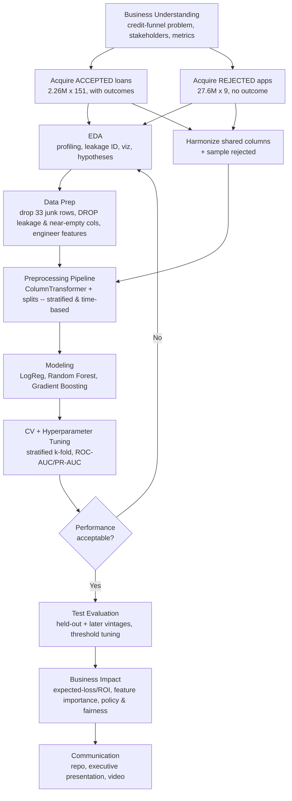

# Project 2 Pitch
## Predicting Loan Default Across the Credit Funnel — Reducing Losses on a Consumer-Lending Platform

**Prepared by:** Eric Bowers, Data Scientist
**Engagement:** Predictive analytics consulting for a consumer-lending client
**Date:** September 19, 2026
**Framework:** CRISP-DM (Cross-Industry Standard Process for Data Mining)

---

## 1. Business Problem Scenario

### The business problem

Our client is a **consumer-lending business** (the LendingClub marketplace model) that faces two sequential decisions on every applicant: **(1) whom to approve and fund**, and **(2) among funded loans, who will repay vs. default (charge off)**. The client earns interest on repaid loans but loses money on charge-offs — roughly **1 in 5 completed loans defaults**. Leadership wants to reduce credit losses *without* simply shrinking the business, by making smarter decisions at the point of application.

Because the client's data captures **both** funded loans (with outcomes) *and* declined applications (without outcomes), this engagement addresses the whole **credit funnel**:

> *Primary question — Default risk:* **Given only what is known at application time, what is the probability a funded loan will default?** (binary classification: *Charged Off* vs. *Fully Paid*), producing a **risk score** for approval/pricing.
>
> *Supporting question — Access & policy:* **What characterized the client's historical approval decisions, and what does that reveal about its credit policy and its geographic fairness?** (using the accepted vs. rejected files together).

The **default-risk model is the primary deliverable** (and satisfies the full modeling rubric); the **approval-policy analysis** is a focused secondary study that *describes* the client's historical credit policy using the rejected-applications data and frames the risk model in the context of who even enters the portfolio.

### Stakeholders

- **Chief Risk Officer (executive sponsor):** owns portfolio credit losses; cares about default rate, expected loss, and risk-adjusted return.
- **Underwriting / Credit Policy team (primary users):** set approval rules and risk cutoffs; consume the risk score and the policy findings.
- **Investors / Portfolio Managers:** fund the loans and bear losses; benefit from better risk selection and pricing.
- **Data & Analytics team (internal partner):** maintains, monitors, and re-trains the model.
- **Compliance / Fair-Lending (guardrail):** ensures the model complies with fair-lending regulation (e.g., ECOA) and uses only permissible variables — directly informed by the policy analysis.

### Primary goals (business outcomes)

1. **Reduce credit losses** — lower the portfolio charge-off rate by scoring default risk before funding.
2. **Improve risk-adjusted return** — keep good borrowers while declining/repricing the riskiest.
3. **Give underwriting a decision tool** — a calibrated risk score with a tunable cutoff mapped to the client's risk appetite.
4. **Illuminate access & policy** — describe who was approved vs. declined historically to support policy and compliance review.

### Why a machine learning approach is appropriate

High-dimensional, nonlinear interactions among dozens of borrower/loan attributes drive default in ways fixed rules miss; millions of labeled historical loans are ideal training data; the business needs a ranked probability (not a yes/no) to prioritize and price; and the model retrains as new performance data arrives and scores at volume — impossible to do consistently by manual review.

### The datasets (as verified in exploratory analysis)

Two real LendingClub files from Kaggle ([`wordsforthewise/lending-club`](https://www.kaggle.com/datasets/wordsforthewise/lending-club)):

| File | Rows | Cols | In-memory | Role |
|------|------|------|-----------|------|
| `accepted_2007_to_2018Q4.csv` | **2,260,701** | **151** | ~6.3 GB | Funded loans **with outcomes** → default model + funnel |
| `rejected_2007_to_2018q4.csv` | **27,648,741** | **9** | ~10.5 GB | Declined applications (no outcome) → access/policy analysis |

**Date range within the data:** issued/applied **2007 through 2018 Q4** (accepted `issue_d` has 139 monthly values; rejected `Application Date` spans 2007-05 to 2018-12).

**Target (accepted file):** `loan_status` (9 categories), reduced to a binary target on **loans with a completed term only**:

- **1 = default:** `Charged Off`, `Default`, and `Does not meet the credit policy. Status:Charged Off`
- **0 = repaid:** `Fully Paid` and `Does not meet the credit policy. Status:Fully Paid`
- **Excluded (in-progress, outcome not yet known):** `Current`, `In Grace Period`, `Late (16-30 days)`, `Late (31-120 days)` — dropped from the modeling set.

**Recomputed default rate (finished-term loans only).** Restricting to loans with a completed term and dropping the in-progress statuses removes roughly the ~40% of the book still `Current`/late, leaving **≈ 1.35 million loans with a known outcome**. On that terminal set the **default (charge-off) rate is ≈ 20% — about 1 in 5** — which is the ~80/20 balance used throughout (the raw file's `Fully Paid` count of **1,076,751** was confirmed in EDA; the exact charge-off count is to be locked from `df_accepted['loan_status'].value_counts()` in the notebook).

### How we derive information from **both** datasets

The two files do **not** share a key and cannot be row-joined; instead we use them in two complementary ways.

**(A) Distribution comparison (EDA).** Compare approved vs. declined applicants on the fields the two files share, to see what separates them (e.g., requested amount, credit score, DTI, employment length, geography, over time).

**(B) Policy-characterization model.** Stack the two files into one labeled dataset — **`approved = 1` (accepted) vs. `0` (rejected)** — on their **harmonized shared columns**, and fit an interpretable model that **describes which application attributes characterized the client's *historical* approval decisions**. This is a **descriptive analysis of past policy** — *not* a tool to predict or automate future approvals, and *not* a counterfactual claim about whether declined applicants would have defaulted (the rejected file has no outcome). Because `Risk_Score` is 66.9% missing in the rejected file, we impute it and add a binary `Risk_Score_missing` indicator, then **fit the policy model both with and without that missing-flag** to test whether the *absence* of a score was itself informative about the historical decision.

Column harmonization between the files:

| Rejected file | Accepted file | Handling |
|---------------|---------------|----------|
| `Amount Requested` | `loan_amnt` | numeric in both |
| `Risk_Score` | `fico_range_low`/`_high` (midpoint) | both credit scores; **`Risk_Score` is 66.9% missing** and on a different scale — compared cautiously / imputed with a `Risk_Score_missing` flag |
| `Debt-To-Income Ratio` (e.g., `"38.64%"`) | `dti` (numeric) | strip `%`, cast to float |
| `Employment Length` | `emp_length` | same category labels |
| `State` | `addr_state` | direct |
| `Zip Code` (`"112xx"`) | `zip_code` | direct; used for geography/fairness |
| `Loan Title` | `title` / `purpose` | messy free text → grouped |
| `Application Date` | `issue_d` | timing differs slightly (application vs. issue) but comparable by year/month |
| `Policy Code` | `policy_code` | **excluded as a feature** — it effectively encodes accept (1) vs. reject (0) and would leak the approval label |

Note the class balance for the policy model is severe (~2.26M approved vs. ~27.6M declined ≈ 7.6% approved) and the combined ~30M rows require **sampling the rejected file** for a tractable, balanced training set.

### Dataset relevance to the business problem

The accepted file's application-time features are exactly what the lender knows before funding, and `loan_status` *is* the outcome we want to prevent — a direct match to the primary decision. The rejected file supplies the other half of the funnel (who never gets funded), enabling the access/policy analysis that credit-policy and compliance stakeholders need.

**⚠️ Data-leakage caveat (central, and now grounded in the real columns).** Many accepted-file columns describe what happened *after* funding and must be removed, or the model becomes an unrealistic near-perfect predictor with no business value:

- **Repayment/outcome fields:** `funded_amnt`, `funded_amnt_inv`, `out_prncp`, `out_prncp_inv`, `total_pymnt`, `total_pymnt_inv`, `total_rec_prncp`, `total_rec_int`, `total_rec_late_fee`, `recoveries`, `collection_recovery_fee`, `last_pymnt_d`, `last_pymnt_amnt`, `next_pymnt_d`, `last_credit_pull_d`, `last_fico_range_high`, `last_fico_range_low`.
- **Post-hoc status/hardship/settlement:** `debt_settlement_flag`, all `settlement_*`, all `hardship_*`, `pymnt_plan`, `chargeoff_within_12_mths`, `collections_12_mths_ex_med`.

**Decision on `grade`, `sub_grade`, and `int_rate` (LendingClub's own risk outputs).** These are assigned by LendingClub *at origination* from its internal scoring model, so they partially encode the target. **Decision: the primary model excludes them**, making it an *independent* risk model that could audit or replace the client's existing scoring rather than merely echo it. We then train a **benchmark variant that includes them** and report the ROC-AUC / PR-AUC difference, quantifying how much incremental signal the client's grade adds. This "with vs. without" comparison is run as a documented experiment, not a single unexamined choice.

### Measuring success — technical and business

| Perspective | Metric | Why it matters |
|-------------|--------|----------------|
| **Business** | Charge-off rate / expected loss reduced at a fixed approval rate | Measures loss avoided by better selection |
| **Business** | Risk-adjusted return / profit per loan (interest − expected loss) | Translates the model into dollars |
| **Technical (primary)** | ROC-AUC, PR-AUC | Rank quality, robust to the ~20% (default) / ~7.6% (approval) imbalance |
| **Technical (secondary)** | Recall & precision at the operating threshold | Defaulters caught vs. quality of the decline list |

**Primary numeric success target:** the final default-risk model achieves **test-set ROC-AUC ≥ 0.70** on the held-out, leakage-free feature set — comfortably above the 0.50 no-skill baseline, and a realistic bar for LendingClub default prediction when `grade`/`int_rate` are excluded.

> **Why not accuracy?** With ~20% defaults, approving everyone scores ~80% accuracy while catching zero defaults. The metrics above reflect the imbalanced, cost-sensitive reality of lending, where a missed default costs far more than a wrongly-declined good loan earns.

---

## 2. Problem-Solving Process

Following **CRISP-DM**, organized to the required process stages. The process is iterative — later findings feed back into earlier stages.

### 2.1 Data Acquisition and Understanding

- **Obtaining and exploring the data.** Both CSVs downloaded from Kaggle into a version-controlled repo. Initial profiling is **complete** (see attached notebook): shapes, dtypes, memory (6.3 GB / 10.5 GB), unique values, and full missingness confirmed.
- **Data-quality findings to act on.** (1) **33 junk rows** in the accepted file (every core field shows exactly 33 nulls) → dropped first. (2) String-formatted numerics to parse: `int_rate`/`revol_util` (percent), `term` (`" 36 months"`), and the rejected `Debt-To-Income Ratio` (`"38.64%"`). (3) High-cardinality free text: `emp_title` (512,694 uniques, 7.4% missing), `title`, `Loan Title`. (4) Extreme skew in `annual_inc`. (5) Class imbalance in both targets. (6) `Risk_Score` 66.9% missing in the rejected file.
- **Visualization strategy.** Target balance; charge-off rate by `grade`/`sub_grade`, `purpose`, `term`, `home_ownership`; distributions of `int_rate`, `dti`, `annual_inc` (log), FICO by outcome; charge-off rate over time via `issue_d`; correlation heatmap of numeric features; and **accepted-vs-rejected** comparison plots (amount, credit score, DTI, employment length, by state and over time).

### 2.2 Data Preparation and Feature Engineering

- **Cleaning.** Drop the 33 junk rows; restrict to finished-term loans and build the binary target; **drop the leakage columns listed above**; drop near-empty columns confirmed in EDA — `member_id` (100% null), all `hardship_*` (~99.5%), all `settlement_*` (~98.5%), all `sec_app_*`/joint fields (~95–98%), `desc` (94%); drop identifiers/URLs (`id`, `url`). Parse string numerics; standardize categoricals; impute the rest (median numeric / explicit category).
- **Feature engineering (using real columns).** `mths_since_last_delinq` / `mths_since_last_record` / `mths_since_last_major_derog` are 51–84% missing where **NaN means "no such event"** → convert to "ever delinquent/derogatory" flags plus a capped numeric. Compute credit-history length from `earliest_cr_line` → `issue_d`; FICO midpoint from `fico_range_low`/`_high`; log-transform monetary fields; group high-cardinality text (`emp_title`, `purpose`/`title`); reduce the ~38%-missing installment/revolving block (`open_il_*`, `il_util`, `all_util`, `open_rv_*`, `total_bal_il`, etc.) via flags or drop after testing; check multicollinearity.
- **scikit-learn Pipeline.** A `ColumnTransformer` (impute + one-hot for categoricals; impute + scale for numerics) inside a `Pipeline` with the estimator, **fit on training data only** — no leakage, fully reproducible. Imbalance handled inside the pipeline via class weights and/or resampling (e.g., SMOTE), compared empirically. The **same pipeline pattern** is reused for the policy-characterization model on the harmonized shared columns (with the rejected file sampled).

### 2.3 Modeling Strategy

- **Algorithms (minimum 3), on the primary default model:** **Logistic Regression** (interpretable, probability-friendly baseline), **Random Forest** (nonlinear ensemble), **Gradient Boosting — XGBoost/LightGBM** (strongest on large tabular data; also memory-efficient at this scale).
- **Cross-validation.** Stratified 5-fold (preserves the ~20% default rate), all preprocessing inside the loop; plus a **time-based split** (train on 2007–2016 vintages, test on 2017–2018) reflecting real deployment and exposing temporal drift.
- **Hyperparameter tuning.** Randomized search for breadth, then focused grid search (Bayesian if time allows), scored on ROC-AUC/PR-AUC.
- **Evaluation metrics & justification.** ROC-AUC/PR-AUC primary (rank quality under imbalance); recall/precision at the chosen operating threshold, because deployment is a risk cutoff. Accuracy is explicitly rejected for the imbalance reason above.
- **Policy-characterization model (secondary).** Uses the same three-algorithm toolkit but keeps scope lighter — primarily to **describe and interpret the drivers of historical approval** and surface geographic fairness signals, not to build a production approval predictor or a second full tuning study. Run with and without the `Risk_Score_missing` flag as noted above.

### 2.4 Results Interpretation and Communication

- **Business translation.** Convert default scores into a **lift/gains curve** and an **expected-loss / profit analysis** (loss avoided and risk-adjusted return at a chosen approval rate); frame the threshold as the client's **risk-appetite dial**. From the policy analysis, report the strongest approval drivers and any **geographic** disparities (by state/ZIP) for compliance review. **The data contains no race, gender, age, or other protected-class fields, so any fairness analysis is explicitly limited to geography** and is treated as a directional signal for further review, not a legal determination of disparate impact.
- **Visualizations.** ROC & PR curves; confusion matrix at the operating threshold; lift/gains and cumulative-loss-avoided charts; feature importance (SHAP if time allows); and accepted-vs-rejected comparison visuals.
- **Explaining to non-technical stakeholders.** Lead with dollars and loss rates, not algorithms; use plain analogies (the score is a "credit-risk thermometer"); translate AUC into intuition ("given one defaulter and one repayer at random, the model ranks the defaulter riskier X% of the time"); one headline number per slide; formulas/code in an appendix; present the cutoff as an approval-rate business choice; address fair-lending directly.

### 2.5 Conceptual Framework

**Proposed solution pipeline (flowchart).** The rendered diagram is shown below (also provided as `Project2_LendingClub_flowchart.png`); the Mermaid source, which GitHub renders natively, follows for reference.

*Figure 1. End-to-end solution pipeline. Keep `Project2_LendingClub_flowchart.png` alongside this document so the image renders.*

Diagram source (Mermaid):

**Dependencies between stages.**

| Stage | Depends on | Produces |
|-------|-----------|----------|
| Business Understanding | Client goals | Problem definition, success metrics |
| Data Acquisition (both files) | Problem definition | Raw datasets in the repo |
| EDA | Raw datasets | Quality findings, leakage list, hypotheses |
| Harmonization | Both files + EDA | Stacked approved/rejected feature set (sampled) |
| Data Preparation | EDA findings | Clean, leakage-free, engineered features |
| Preprocessing Pipeline | Clean features | Fitted transformer + splits |
| Modeling | Pipeline + splits | Trained candidate models |
| CV + Tuning | Candidate models | Tuned models + validation scores *(loops back if weak)* |
| Test Evaluation | Best tuned model | Performance on unseen & later-vintage data |
| Business Impact | Final model + policy analysis | Expected-loss/ROI + policy/fairness findings |
| Communication | All prior outputs | Repo, presentation, video |

Cross-cutting: **Git/GitHub version control and the reproducible sklearn pipeline underpin every stage.**

**Tools:** Python, pandas, scikit-learn, XGBoost/LightGBM, imbalanced-learn, matplotlib/seaborn, Jupyter, Git/GitHub.

---

## 3. Timeline and Scope

### Scope

**In scope:** primary **default-risk classification** (charged off vs. fully paid at application time) on the accepted-loans file; a **secondary access/policy analysis** using the accepted + rejected files together (comparison + policy-characterization model + geographic fairness lens); a full reproducible CRISP-DM workflow (EDA → leakage-free pipeline → 3+ tuned models → held-out & time-based evaluation → business impact); interpretability; expected-loss/ROI recommendation. Deliverables: GitHub repo (notebook + README + assets), MVP, executive presentation + video.

**Out of scope (assumptions):** production deployment and live origination-system integration (discussed conceptually); external/macroeconomic data; a full loan-pricing (interest-rate) regression model; predicting or automating future approval decisions; and formal reject inference / counterfactual modeling of declined applicants (the rejected file has no outcome — treated as a documented limitation, not a modeling target). The terminal-loan subset is treated as representative.

### Timeline

Estimates for a ~5-week effort; adjust to your actual course dates. Milestones (Pitch → MVP → Final repo → Showcase) noted. *EDA/profiling is already underway (attached notebook), so Phase 1–2 are partly complete.*

| Phase | Time | Key activities | Milestone |
|-------|------|----------------|-----------|
| 1. Dataset finalization & problem formulation | Days 1–3 | Acquire both files, confirm shapes/quality, refine problem, repo setup | **Pitch** |
| 2. Exploratory Data Analysis | Days 3–8 | Profiling (done), leakage ID, accepted-vs-rejected comparison, stats, visuals, insights | |
| 3. Data Preprocessing | Days 8–13 | Drop junk/leakage/near-empty cols, parse strings, engineer features, build pipeline, harmonize + sample rejected, train/val/test splits | |
| 4. Model Development | Days 13–19 | Baselines, 3+ algorithms, tuning, CV (default model); policy-characterization model | **MVP (~90%)** |
| 5. Evaluation & Refinement | Days 19–23 | Final selection, test-set + later-vintage eval, expected-loss/ROI, interpretation, fairness | |
| 6. Documentation & Reporting | Days 23–28 | Code cleanup, README + technical report, executive presentation | **Final repo** |
| 7. Final Review & Submission | Days 28–31 | QA, video recording, submission, peer feedback | **Showcase** |

### Potential challenges & areas for additional research/learning

- **Memory/scale (the biggest practical hurdle):** 6.3 GB + 10.5 GB in memory. Needs dtype downcasting, `usecols` to load only kept columns, and **sampling the 27.6M-row rejected file**; boosting libraries chosen partly for memory efficiency.
- **Data leakage (central):** rigorous separation of application-time vs. post-origination fields, with a documented feature whitelist; plus the `grade`/`int_rate` with/without benchmark.
- **Using two mismatched files:** harmonizing differently-named, differently-formatted columns; `Risk_Score` 66.9% missing (tested with/without a missing-flag); `Policy Code` excluded as a label proxy; and the honest limitation that rejected applicants have no outcome (**reject inference** is out of scope but worth noting).
- **Messy real-world data:** string parsing (`%`, `" 36 months"`), high-cardinality text (`emp_title` 512k uniques), extreme income skew, and the `mths_since_*` "NaN = never" semantics.
- **Class imbalance** (~20% default; ~7.6% approval) — class weights vs. resampling, applied inside CV folds only.
- **Cost-sensitive thresholds & probability calibration** (Platt/isotonic) so the risk score and ROI estimates are trustworthy.
- **Temporal drift** across 2007–2018 credit conditions → time-based validation and vintage analysis.
- **Fair lending / geographic disparity:** the data has **no protected-class fields**, so fairness review is limited to geography (state/ZIP) and treated as directional — an area to research given the regulated context.
- **SHAP interpretability** — strengthens the stakeholder story; may need additional learning.

### Definition of success for the engagement

The project succeeds if the default-risk model **meets its numeric target (test ROC-AUC ≥ 0.70) and meaningfully reduces expected credit losses at a sensible approval rate** versus indiscriminate lending, the policy analysis yields **clear, defensible descriptions of historical approval drivers and geographic fairness**, and both are communicated to executives as a credible, compliant, risk-adjusted-return story with actionable recommendations.

---

*Prepared as Part 1 of the Project 2 capstone. Datasets: LendingClub accepted (`accepted_2007_to_2018Q4.csv`, 2,260,701 × 151) and rejected (`rejected_2007_to_2018q4.csv`, 27,648,741 × 9) loan data, 2007–2018 Q4, via Kaggle (`wordsforthewise/lending-club`). Initial profiling performed by the author (see accompanying notebook).*
