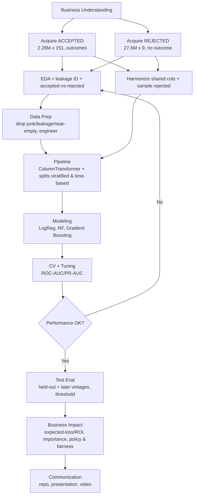

# Project 2 Pitch (Condensed)
## Predicting Loan Default Across the Credit Funnel — Reducing Lending Losses

**Eric Bowers, Data Scientist** · Consumer-lending client engagement · September 19, 2026 · Framework: CRISP-DM

---

## 1. Business Problem Scenario

**Problem.** Our client is a consumer-lending business (LendingClub marketplace model) that makes two decisions on every applicant: **whom to fund**, and **among funded loans, who will default (charge off)** — about **1 in 5 completed loans**. The client wants to cut credit losses without shrinking the business by deciding smarter at application time. Because the data includes **both funded loans (with outcomes)** and **declined applications (no outcome)**, we address the whole **credit funnel**:
- **Primary — Default risk:** given only application-time information, predict the probability a funded loan defaults (binary: Charged Off vs. Fully Paid) → a **risk score** for approval/pricing. *This is the main deliverable and satisfies the modeling rubric.*
- **Supporting — Access/policy:** use accepted + rejected files to **describe** what characterized the client's historical approval decisions (policy drivers + geographic fairness lens).

**Stakeholders.** Chief Risk Officer (sponsor; owns losses); Underwriting/Credit Policy (primary users); Investors/Portfolio Managers (bear losses); Data & Analytics (maintains model); Compliance/Fair-Lending (guardrail, informed by the policy analysis).

**Goals.** (1) Reduce charge-off rate; (2) improve risk-adjusted return; (3) give underwriting a calibrated risk score with a tunable cutoff; (4) illuminate historical access & policy.

**Why ML.** High-dimensional nonlinear interactions drive default; millions of labeled loans are ideal training data; the business needs a ranked probability (not yes/no); the model retrains and scores at volume.

**Datasets (verified in EDA — see attached notebook).**

| File | Rows | Cols | Role |
|---|---|---|---|
| `accepted_2007_to_2018Q4.csv` | 2,260,701 | 151 | funded loans **with outcomes** → default model |
| `rejected_2007_to_2018q4.csv` | 27,648,741 | 9 | declined apps (no outcome) → access analysis |

Date range: **2007–2018 Q4**. **Target** (`loan_status`, 9 categories) → binary on **finished-term** loans: **1** = Charged Off / Default / "Does not meet…Charged Off"; **0** = Fully Paid / "Does not meet…Fully Paid"; **excluded** = Current, In Grace Period, Late (16-30), Late (31-120) (outcome unknown). **Recomputed default rate:** dropping in-progress loans leaves **≈1.35M loans with a known outcome, ≈20% default (about 1 in 5)** — the ~80/20 balance used throughout (Fully Paid = 1,076,751 confirmed in EDA; exact charge-off count to be locked from `value_counts()`).

**Using both datasets.** They share no key, so (A) **compare** approved vs. declined on shared fields in EDA, and (B) fit a **policy-characterization model** (`approved=1` accepted vs. `0` rejected) on harmonized shared columns — a **descriptive** model of *historical* approval policy, **not** a predictor of future approvals and **not** a counterfactual about declined applicants (no outcome exists). Rejected file **sampled** (~7.6% approved). Because `Risk_Score` is **66.9% missing**, we impute it + add a `Risk_Score_missing` flag and **fit the policy model with and without that flag**. Harmonization: `Amount Requested`↔`loan_amnt`; `Risk_Score`↔FICO midpoint; `Debt-To-Income Ratio` "38.64%"↔`dti` (strip `%`); `Employment Length`↔`emp_length`; `State`↔`addr_state`; `Zip Code`↔`zip_code`; `Loan Title`↔`title`/`purpose`; `Application Date`↔`issue_d`. **`Policy Code` excluded** — it encodes the accept/reject label.

**⚠️ Leakage (grounded in real columns).** Drop all post-funding fields: `funded_amnt*`, `out_prncp*`, `total_pymnt*`, `total_rec_*`, `recoveries`, `collection_recovery_fee`, `last_pymnt_*`, `next_pymnt_d`, `last_credit_pull_d`, `last_fico_*`, all `hardship_*`, all `settlement_*`/`debt_settlement_flag`, `pymnt_plan`, `chargeoff_within_12_mths`, `collections_12_mths_ex_med`. **Decision on `grade`/`sub_grade`/`int_rate`:** LendingClub sets these at origination from its own scoring, so they partly encode the target — **the primary model excludes them** (an independent risk model), and we train a **benchmark variant that includes them** to quantify the added signal.

**Success metrics.** Business: charge-off/expected-loss reduction at a fixed approval rate; risk-adjusted return per loan. Technical: **ROC-AUC & PR-AUC** primary (robust to imbalance); recall/precision at the operating threshold. **Numeric target: test-set ROC-AUC ≥ 0.70** on the leakage-free feature set. *Accuracy rejected — approving everyone scores ~80% and catches zero defaults.*

---

## 2. Problem-Solving Process (CRISP-DM)

**2.1 Data Acquisition & Understanding.** Both CSVs in a version-controlled repo; profiling **done** (shapes, dtypes, 6.3 GB/10.5 GB memory, missingness). Act on: **33 junk rows** (accepted) dropped first; parse string numerics (`int_rate`, `term` " 36 months", rejected DTI "%"); high-cardinality text (`emp_title` 512k uniques); income skew; imbalance; `Risk_Score` 66.9% missing. Visuals: target balance; charge-off by grade/purpose/term; `int_rate`/`dti`/income(log)/FICO by outcome; charge-off over time; correlation heatmap; accepted-vs-rejected comparisons.

**2.2 Data Preparation & Feature Engineering.** Drop 33 junk rows; keep finished-term loans + build target; **drop leakage + near-empty columns** (`member_id` 100%, `hardship_*` ~99.5%, `settlement_*` ~98.5%, `sec_app_*`/joint ~95–98%, `desc` 94%) + IDs/URLs. Parse strings; impute (median / explicit category). Engineer: `mths_since_last_*` (51–84% missing, NaN="never") → flags + capped numeric; credit-history age from `earliest_cr_line`; FICO midpoint; log income; group text; reduce the ~38%-missing installment/revolving block. **sklearn `Pipeline` + `ColumnTransformer`** fit on train only (no leakage); imbalance via class weights/resampling inside CV. Same pipeline reused for the policy-characterization model on harmonized columns.

**2.3 Modeling Strategy.** 3+ algorithms on the default model: **Logistic Regression** (baseline), **Random Forest**, **Gradient Boosting/XGBoost/LightGBM**. **CV:** stratified 5-fold (all prep inside the loop) **plus a time-based split** (train 2007–2016, test 2017–2018) for realism/drift. **Tuning:** randomized → focused grid, scored on ROC-AUC/PR-AUC. Policy-characterization model uses the same toolkit, lighter tuning, run with/without the `Risk_Score_missing` flag.

**2.4 Interpretation & Communication.** Scores → **lift/gains curve** + **expected-loss/profit** at a chosen approval rate (threshold = risk-appetite dial); report approval drivers + **geographic** fairness. *The data has no race, gender, or age fields, so fairness is limited to geography (state/ZIP) and treated as directional, not a legal determination.* Visuals: ROC/PR curves, confusion matrix, lift/loss-avoided, feature importance (SHAP if time). For executives: lead with dollars, plain analogies ("credit-risk thermometer"), AUC in intuition, one headline number/slide, appendix for detail, address fair lending.

**2.5 Conceptual Framework.** Rendered pipeline below (`Project2_LendingClub_flowchart.png`); Mermaid source follows.

*Figure 1. End-to-end solution pipeline. Keep the PNG alongside this document so the image renders.*

**Dependencies.** Business Understanding → problem/metrics; Acquisition (both files) → raw data; EDA → quality findings + leakage list; Harmonization → stacked approved/rejected set; Prep → clean features; Pipeline → transformer + splits; Modeling → candidates; CV/Tuning → tuned models (loops back if weak); Test → unseen performance; Business Impact → recommendations + fairness; Communication → deliverables. **Git + reproducible pipeline underpin every stage.**

**Tools:** Python, pandas, scikit-learn, XGBoost/LightGBM, imbalanced-learn, matplotlib/seaborn, Jupyter, Git/GitHub.

---

## 3. Timeline & Scope

**In scope:** primary default-risk classification (accepted file) + secondary access/policy analysis (both files); full reproducible CRISP-DM workflow; interpretability; expected-loss/ROI recommendation; deliverables = repo, MVP, executive presentation + video.
**Out of scope:** production deployment; external/macro data; full interest-rate regression; predicting/automating future approvals; formal reject inference/counterfactual modeling of declined applicants (no outcome — documented limitation).

| Phase | Time | Activities | Milestone |
|---|---|---|---|
| 1. Dataset finalization & problem formulation | Days 1–3 | Acquire both files, confirm quality, refine problem, repo | **Pitch** |
| 2. Exploratory Data Analysis | Days 3–8 | Profiling (done), leakage ID, accepted-vs-rejected, stats, visuals | |
| 3. Data Preprocessing | Days 8–13 | Drop junk/leakage/near-empty, parse, engineer, pipeline, harmonize+sample, splits | |
| 4. Model Development | Days 13–19 | Baselines, 3+ algorithms, tuning, CV; policy-characterization model | **MVP (~90%)** |
| 5. Evaluation & Refinement | Days 19–23 | Final selection, test + later-vintage eval, expected-loss/ROI, fairness | |
| 6. Documentation & Reporting | Days 23–28 | Code cleanup, README + report, executive presentation | **Final repo** |
| 7. Final Review & Submission | Days 28–31 | QA, video, submission, peer feedback | **Showcase** |

**Challenges / learning needs:** memory/scale (6.3 + 10.5 GB → dtype downcasting, `usecols`, sample the 27.6M rejected rows); leakage discipline + `grade`/`int_rate` benchmark; harmonizing two mismatched files (`Risk_Score` 66.9% missing tested with/without a flag, `Policy Code` label leak, no outcome in rejected); messy parsing + `mths_since_*` "NaN=never"; imbalance inside CV; cost-sensitive thresholds + probability calibration; temporal drift; geographic fairness only (no protected-class fields); SHAP.

**Definition of success:** the default model meets its numeric target (test ROC-AUC ≥ 0.70) and meaningfully reduces expected losses at a sensible approval rate vs. indiscriminate lending; the policy analysis yields clear, defensible descriptions of historical approval drivers and geographic fairness; both communicated to executives as a credible, compliant, risk-adjusted-return story.

---
*Datasets: LendingClub accepted (2,260,701 × 151) & rejected (27,648,741 × 9), 2007–2018 Q4, via Kaggle (`wordsforthewise/lending-club`). Initial profiling by the author (see accompanying notebook).*
